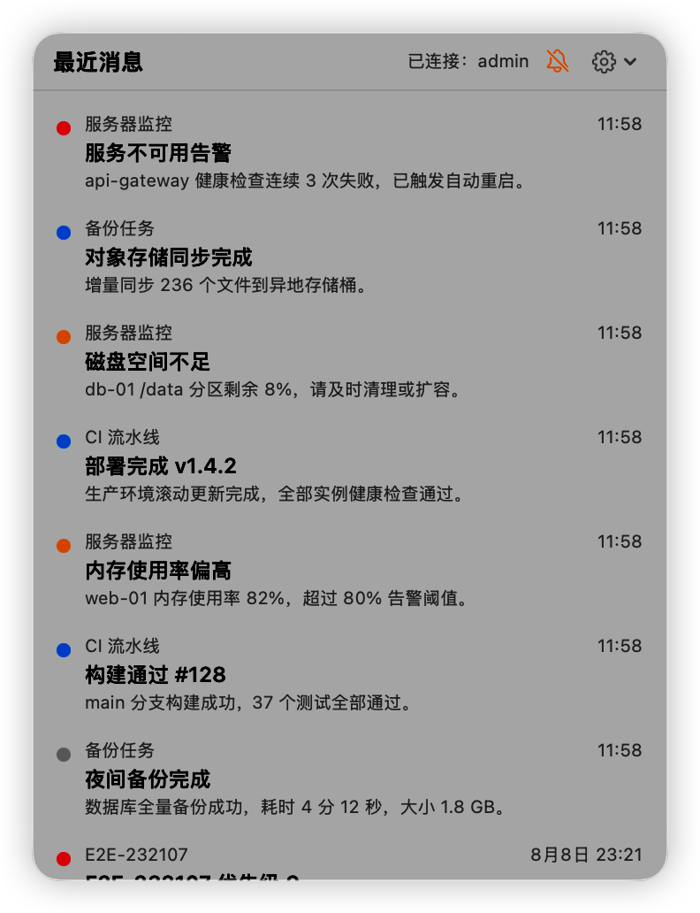
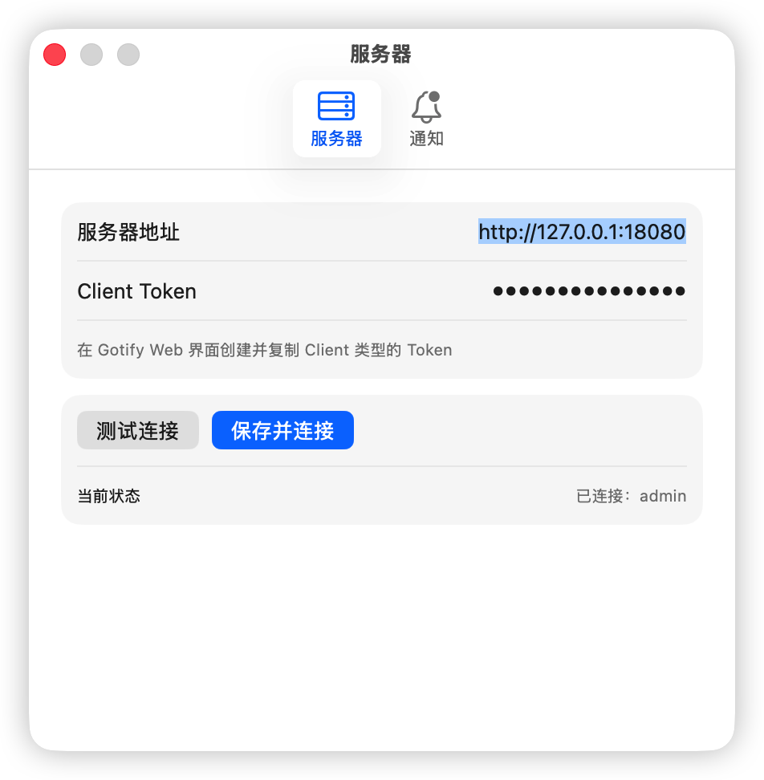

# Gotify Mac

[](#系统要求)
[](Package.swift)
[](LICENSE)

一个面向 macOS 的 [Gotify](https://gotify.net/) 原生菜单栏客户端，使用 Swift + SwiftUI 编写，零第三方依赖。

连接你自建的 Gotify Server，在菜单栏实时接收推送消息，以未读圆点提示新消息。

## 截图

| 菜单栏消息面板 | 设置窗口 |
| :---: | :---: |
|  |  |

## 功能

- **菜单栏常驻**：`MenuBarExtra` 面板，无 Dock 图标；单栏消息列表，点击展开双栏详情。
- **实时接收**：WebSocket stream 实时推送；断线指数退避自动重连，重连后补拉遗漏消息并去重。
- **未读提醒**：有未读消息时菜单栏铃铛变为角标样式，列表中未读消息带圆点标记，一键全部已读。
- **优先级标识**：四档色点直观区分消息优先级（≥8 红、4–7 橙、1–3 蓝、0 灰）。
- **应用内设置**：服务器地址、Client Token（带连接测试），即改即生效。
- **隐私友好**：消息只在内存中保留最近 200 条，不落盘；配置存放在本地用户目录，Token 不进源码、日志和 Git。

## 系统要求

- macOS 14 (Sonoma) 或更高版本
- 一个可访问的 [Gotify Server](https://gotify.net/docs/install)（自建）

## 安装与运行

### 下载安装包（推荐）

从 [Releases](https://github.com/zuijiaosy/gotify-mac/releases) 下载最新的 `Gotify-Mac-*.dmg`，打开后把 **Gotify Mac** 拖进「应用程序」。

安装包是 ad-hoc 签名、未经 Apple 公证的（公证需要付费开发者账号，见 ADR-013），首次打开会被 Gatekeeper 拦截，任选一种方式放行：

- 在「应用程序」里右键点图标 → **打开** → 弹窗里再点「打开」；
- 或执行 `xattr -dr com.apple.quarantine "/Applications/Gotify Mac.app"`。

应用没有 Dock 图标，启动后在菜单栏出现铃铛图标。

### 从源码构建

无需 Xcode.app，Command Line Tools + Swift 6 工具链即可：

```bash
git clone https://github.com/zuijiaosy/gotify-mac.git
cd gotify-mac
./start.sh
```

`start.sh` 会构建 release 版本、组装并启动 `build/Gotify Mac.app`（ad-hoc 签名）。启动后菜单栏出现铃铛图标。

## 配置

首次使用：点击菜单栏铃铛 → 齿轮菜单 → **设置…**，在「服务器」标签填入：

1. **服务器地址**：你的 Gotify Server 地址，例如 `https://gotify.example.com`。
2. **Client Token**：在 Gotify Web 界面 **CLIENTS** 页创建并复制（注意是 Client Token，不是 App Token）。
3. 点「测试连接」验证，再点「保存并连接」。

配置保存在 `~/Library/Application Support/GotifyMac/config.json`（文件权限 600），也可以直接手工编辑该文件。

## 开发

### 本地 Gotify 服务端

仓库自带 docker-compose，一键起一个本地测试服务端：

```bash
docker compose -f deploy/gotify/docker-compose.yml up -d
```

服务地址 `http://127.0.0.1:18080`，Web 管理界面默认账号 `admin/admin`。数据存放在 `deploy/gotify/data/`（已 gitignore，内含 Token，不得提交）。

### 常用命令

```bash
swift build                    # 仅构建（debug）
scripts/build-app.sh           # 构建 release 并组装 .app
scripts/make-dmg.sh            # 把已组装的 .app 打成 build/Gotify-Mac-<版本>.dmg
scripts/test.sh                # 单元测试（CLT 环境必须用此脚本，不要直接 swift test）
GOTIFY_E2E=1 scripts/test.sh   # 含打真实本地服务端的集成测试
scripts/e2e-ui-check.sh        # 半自动端到端 UI 验证（需终端有辅助功能+屏幕录制权限）
```

### 发布

推送 `v` 开头的标签即触发 `.github/workflows/release.yml`：跑测试 → 构建通用二进制（arm64 + x86_64）→ 打 DMG → 创建 GitHub Release 并上传。版本号取自标签。

```bash
git tag v0.2.0 && git push origin v0.2.0
```

workflow 也支持在 Actions 页手动触发，只产出构建物、不创建 Release，可用来试跑。

### 项目文档

- [`docs/ARCHITECTURE.md`](docs/ARCHITECTURE.md) — 架构与模块边界（已实现 / 计划分开描述）。
- [`docs/DECISIONS.md`](docs/DECISIONS.md) — 已接受的架构决策记录（ADR）。
- [`docs/CURRENT_STATE.md`](docs/CURRENT_STATE.md) — 当前进度、已知问题与下一步，项目进度的唯一事实来源。
- [`AGENTS.md`](AGENTS.md) — 面向 Coding Agent 的协作与文档同步规则。

### 参与贡献

欢迎 Issue 和 PR。提交代码前请：

1. 阅读上述项目文档，遵守既有模块边界与代码风格。
2. 跑通 `scripts/test.sh`；行为变化请补测试。
3. 不提交任何服务器地址、Token 等凭据；测试夹具不含真实消息内容。

## 已知限制

- 未做跨设备已读同步与消息删除（第一版明确不做，见 ADR）。
- 无系统通知横幅：新版 macOS（实测 macOS 26）对 ad-hoc 签名应用拒绝通知授权，已决策移除该功能入口，新消息以菜单栏未读角标与列表圆点提示（详见 `docs/DECISIONS.md` ADR-012）。
- 安装包未经 Apple 公证，首次打开需手动放行；也没有自动更新，新版本需回 Releases 页下载。

## 许可证

[MIT](LICENSE) © zuijiaosy
